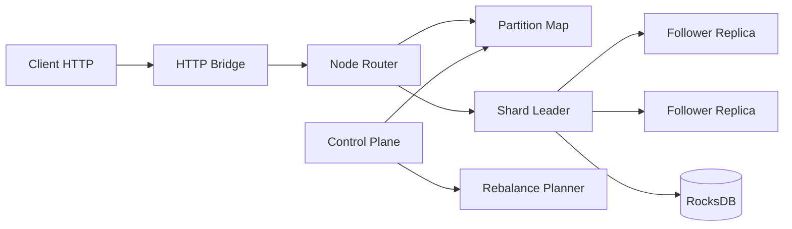

# NotDynamo

NotDynamo is a practical, educational key-value store project focused on distributed systems fundamentals with production-style engineering discipline.

It started with a concrete target: design toward a Dynamo-style system with high throughput goals, while keeping implementation and iteration simple enough to run and benchmark locally and on cloud Kubernetes.

## Why NotDynamo

- Learn distributed KV design by building each subsystem end-to-end.
- Keep architecture cloud-portable: same core deploy model for local Kubernetes and EKS.
- Use measurable milestones: every major task is versioned, tested, and benchmarked.

## Built Entirely With Codex

This repository was implemented end-to-end using Codex in task branches, then merged forward.

Milestone branches:

- `codex/e0-foundation`: project bootstrap, proto/contracts, Gradle modules
- `codex/e1-single-node`: durable single-node GET/PUT/DELETE path
- `codex/e2-local-sharding`: consistent-hash local sharding and routing
- `codex/e3-multi-node`: partition map + multi-node routing scaffolding
- `codex/e4-quorum-raft`: quorum/raft simulation modules and tests
- `codex/e5-eventual-reads`: eventual read routing + freshness selection
- `codex/e6-rebalance`: rebalance planner and replica-move orchestration
- `codex/e7-k8s`: Kubernetes manifests and lease election integration
- `codex/e8-observability`: metrics + SLO/alerting primitives
- `codex/e9-performance`: local/cloud benchmark tooling, EKS workflows, reports
- `codex/e10-runtime-router-bootstrap`: router-first runtime activation + gRPC node transport
- `codex/e11-failure-drills`: Kubernetes failure drill scripts and verification gate extensions
- `codex/e12-true-distributed-data-path`: live HTTP->gRPC multi-node routing verification
- `codex/e13-failure-verification-matrix`: codified failure-mode verification runbook
- `codex/e14-leader-quorum-replication`: leader-quorum write path and internal replica-apply service
- `codex/e15-control-plane-runtime`: replace placeholder control-plane with a real runtime process

Default branch `main` always points to the latest completed task state.

## Architecture

### Core Components

- `node/`: data-plane node runtime (gRPC service + HTTP bridge)
- `control-plane/`: partition map, membership, rebalance, lease and SLO logic
- `storage-rocksdb/`: RocksDB-backed local durable storage
- `proto/`: gRPC and API contracts
- `raft-ratis/`: quorum/raft-oriented modules and integration tests

### Data Model and API (current)

- Operations: `GET`, `PUT`, `DELETE`
- Simple key/value payload assumptions
- Durable local persistence via RocksDB

### Topology and Consistency Model (design target)

- Consistent-hash partitioning
- Single leader per shard
- Replication factor = 3
- Quorum write semantics target: leader + 1 replica ack
- Eventual reads with freshness target under 1 second staleness

### Request Path

- External clients: HTTP (`/v1/kv/{key}`)
- Internal node communication: gRPC
- Reads may route to non-leader replicas in eventual mode

### High-Level Diagram



## Deployment Model

NotDynamo uses a portable Kubernetes base with environment overlays.

- Base manifests: `/deploy/k8s/base`
- Local overlay: `/deploy/k8s/overlays/local`
- EKS overlay: `/deploy/k8s/overlays/eks`

### Local Kubernetes

Use kind + docker/finch for iterative development and smoke tests.

```bash
./scripts/local/kind_up.sh --workers 2 --provider nerdctl
./scripts/local/kind_deploy.sh --data-replicas 3 --provider nerdctl
./scripts/local/kind_smoke.sh --namespace notdynamo
./scripts/local/kind_cross_node_smoke.sh --namespace notdynamo
./scripts/local/kind_failure_pod_restart.sh --namespace notdynamo --failed-pod notdynamo-data-0
```

### EKS

Use scripted lifecycle for cost-controlled create/deploy/bench/teardown.

```bash
./scripts/eks/eks_up.sh --name notdynamo-eks --region us-west-2
./scripts/eks/eks_deploy.sh --name notdynamo-eks --region us-west-2 --provider nerdctl
./scripts/eks/eks_smoke.sh --name notdynamo-eks --region us-west-2
./scripts/eks/eks_bench_http.sh --name notdynamo-eks --region us-west-2 --operations 10000 --threads 16 --read-ratio 0.90 --preload false
./scripts/eks/eks_down.sh --name notdynamo-eks --region us-west-2 --delete-ecr-repo
```

Security defaults:

- Data service in EKS uses `ClusterIP` (no public load balancer)
- Access for smoke/bench uses `kubectl port-forward`
- EKS API endpoint is restricted by CIDR by default

## Benchmark Snapshot (Latest)

Latest end-to-end benchmark report:

- Report file: `/reports/benchmarks/aws/e2e_http_20260217T101331Z.md`
- Timestamp (UTC): `2026-02-17T10:14:22Z`
- Scenario: E2E HTTP against EKS service via local port-forward
- Config: `operations=10000`, `threads=16`, `read_ratio=0.90`, `preload=false`

Results:

- Throughput: `202.93 rps`
- Success throughput: `187.82 rps`
- p50: `78.870 ms`
- p95: `90.225 ms`
- p99: `285.645 ms`
- Error rate: `7.45%` (observed HTTP 500s)

Notes:

- This run is a functional end-to-end baseline, not a hardware-maximized throughput run.
- Current benchmark focus is correctness, repeatability, and regression tracking.

## Repository Layout

- `/node`: node runtime and HTTP bridge
- `/control-plane`: control-plane services and planning logic
- `/storage-rocksdb`: storage engine integration
- `/proto`: API contracts
- `/it`: integration tests
- `/scripts`: local, EKS, verification, and benchmark scripts
- `/reports`: benchmark and verification outputs

## Current Status

- End-to-end local and EKS deploy flows are operational.
- Runtime now supports partitioned request routing across nodes using gRPC node-to-node forwarding.
- Runtime now supports leader-quorum writes (`quorum=2`) with internal replica-apply RPC.
- Control-plane deployment now runs an executable process with `/healthz` and `/v1/partition-map` endpoints.
- New verification gates `G10` to `G14` validate distributed routing, failure-drill scripts, quorum writes, and control-plane runtime.
- Automated setup/teardown scripts include cost-control safeguards.
- Benchmark harness and human-readable reports are source-controlled.

Primary next engineering focus:

- Drive down HTTP 500 rate in end-to-end benchmarks
- Improve p99 latency stability
- Continue scaling experiments on cloud-sized clusters
