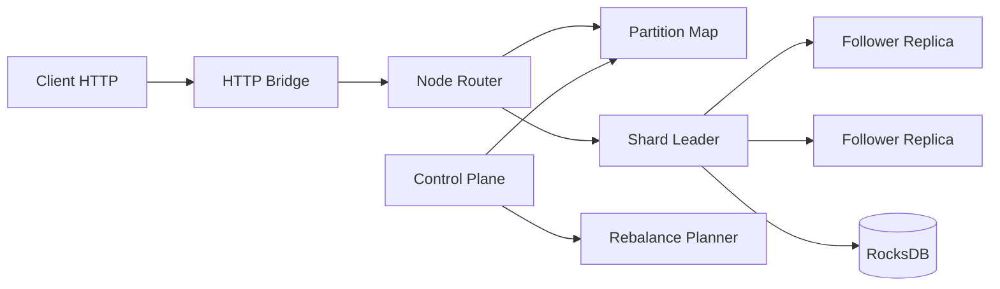

# NotDynamo

NotDynamo is a practical, educational key-value store project focused on distributed systems fundamentals with production-style engineering discipline.

It started with a concrete target: design toward a Dynamo-style system with high throughput goals, while keeping implementation and iteration simple enough to run and benchmark locally and on cloud Kubernetes.

## Why NotDynamo

- Learn distributed KV design by building each subsystem end-to-end.
- Keep architecture cloud-portable: same core deploy model for local Kubernetes and EKS.
- Use measurable milestones: every major task is versioned, tested, and benchmarked.

## Built Entirely With Codex

This repository was implemented end-to-end using Codex in task branches, then merged forward.

Milestone branches:

- `codex/e0-foundation`: project bootstrap, proto/contracts, Gradle modules
- `codex/e1-single-node`: durable single-node GET/PUT/DELETE path
- `codex/e2-local-sharding`: consistent-hash local sharding and routing
- `codex/e3-multi-node`: partition map + multi-node routing scaffolding
- `codex/e4-quorum-raft`: quorum/raft simulation modules and tests
- `codex/e5-eventual-reads`: eventual read routing + freshness selection
- `codex/e6-rebalance`: rebalance planner and replica-move orchestration
- `codex/e7-k8s`: Kubernetes manifests and lease election integration
- `codex/e8-observability`: metrics + SLO/alerting primitives
- `codex/e9-performance`: local/cloud benchmark tooling, EKS workflows, reports
- `codex/e10-runtime-router-bootstrap`: router-first runtime activation + gRPC node transport
- `codex/e11-failure-drills`: Kubernetes failure drill scripts and verification gate extensions
- `codex/e12-true-distributed-data-path`: live HTTP->gRPC multi-node routing verification
- `codex/e13-failure-verification-matrix`: codified failure-mode verification runbook
- `codex/e14-leader-quorum-replication`: leader-quorum write path and internal replica-apply service
- `codex/e15-control-plane-runtime`: replace placeholder control-plane with a real runtime process
- `codex/e16-node-drain-recovery-drill`: node-level local recovery drill and validation updates
- `codex/e17-eks-cost-guardrails`: enforce default EKS budget cap during cluster creation
- `codex/e18-aggregate-correctness-gate`: aggregate pre-benchmark correctness gate (`G18`)
- `codex/e19-gated-benchmark-runner`: benchmark wrapper that runs `G18` before E2E profile
- `codex/e20-true-raft-integration`: runtime consensus migration to Apache Ratis with router integration verification

Default branch `main` always points to the latest completed task state.

## Task Management and Checkpoints

Task tracking uses Beads (`bd`) in-repo. To see the active roadmap tree:

```bash
bd list --tree --limit 0
bd ready --limit 20
```

For checkpointed execution of each task, use:

```bash
./scripts/tasks/checkpoint.sh --id <issue-id> --claim --status in_progress --note "started"
./scripts/tasks/checkpoint.sh --id <issue-id> --note "progress update"
./scripts/tasks/checkpoint.sh --id <issue-id> --note "acceptance met" --close
```

Detailed process: `/docs/process/TASK_CHECKPOINTS.md`

## Architecture

### Core Components

- `node/`: data-plane node runtime (gRPC service + HTTP bridge)
- `control-plane/`: partition map, membership, rebalance, lease and SLO logic
- `storage-rocksdb/`: RocksDB-backed local durable storage
- `proto/`: gRPC and API contracts
- `raft-ratis/`: quorum/raft-oriented modules and integration tests

### Data Model and API (current)

- Operations: `GET`, `PUT`, `DELETE`
- Simple key/value payload assumptions
- Durable local persistence via RocksDB

### Topology and Consistency Model (design target)

- Consistent-hash partitioning
- Single leader per shard
- Replication factor = 3
- Quorum write semantics target: leader + 1 replica ack
- Eventual reads with freshness target under 1 second staleness

### Request Path

- External clients: HTTP (`/v1/kv/{key}`)
- Internal node communication: gRPC
- Reads may route to non-leader replicas in eventual mode

### High-Level Diagram



## Deployment Model

NotDynamo uses a portable Kubernetes base with environment overlays.

- Base manifests: `/deploy/k8s/base`
- Local overlay: `/deploy/k8s/overlays/local`
- EKS overlay: `/deploy/k8s/overlays/eks`

### Local Kubernetes

Use kind + docker/finch for iterative development and smoke tests.

```bash
./scripts/local/kind_up.sh --workers 2 --provider nerdctl
./scripts/local/kind_deploy.sh --data-replicas 3 --provider nerdctl
./scripts/local/kind_smoke.sh --namespace notdynamo
./scripts/local/kind_cross_node_smoke.sh --namespace notdynamo
./scripts/local/kind_failure_pod_restart.sh --namespace notdynamo --failed-pod notdynamo-data-0
```

### EKS

Use scripted lifecycle for cost-controlled create/deploy/bench/teardown.

```bash
./scripts/eks/eks_up.sh --name notdynamo-eks --region us-west-2
./scripts/eks/eks_deploy.sh --name notdynamo-eks --region us-west-2 --provider nerdctl
./scripts/eks/eks_smoke.sh --name notdynamo-eks --region us-west-2
./scripts/eks/eks_bench_http.sh --name notdynamo-eks --region us-west-2 --operations 10000 --threads 16 --read-ratio 0.90 --preload false
./scripts/eks/eks_bench_http.sh --name notdynamo-eks --region us-west-2 --endpoint-mode load-balancer --lb-type nlb --lb-scheme internet-facing --operations 10000 --threads 16 --read-ratio 0.90 --preload false
./scripts/eks/eks_bench_job_up.sh --name notdynamo-eks --region us-west-2 --operations 10000 --parallelism 4 --completions 4 --preload false
./scripts/eks/eks_bench_matrix.sh --name notdynamo-eks --region us-west-2 --operations 10000 --preload false
./scripts/eks/eks_bench_matrix.sh --name notdynamo-eks --region us-west-2 --external-mode load-balancer --operations 10000 --preload false
./scripts/eks/eks_scaling_sweep.sh --name notdynamo-eks --region us-west-2 --node-counts 2,3,4 --data-replicas 3,6 --operations 10000 --preload false
./scripts/eks/eks_runbook.sh --name notdynamo-eks --region us-west-2 --max-daily-usd 20 --operations 10000 --preload false
./scripts/eks/eks_down.sh --name notdynamo-eks --region us-west-2 --delete-ecr-repo
```

Security defaults:

- Data service in EKS uses `ClusterIP` (no public load balancer)
- Access for smoke uses `kubectl port-forward`; benchmark supports both `port-forward` and optional `LoadBalancer/NLB` mode
- EKS API endpoint is restricted by CIDR by default

## Benchmark Snapshot (Latest)

Benchmark categories currently supported on EKS:

- External client via port-forward: `scripts/eks/eks_bench_http.sh`
- External client via LoadBalancer/NLB: `scripts/eks/eks_bench_http.sh --endpoint-mode load-balancer`
- In-cluster benchmark job: `scripts/eks/eks_bench_job_up.sh`
- Category matrix summary: `scripts/eks/eks_bench_matrix.sh`
- Horizontal scaling sweeps: `scripts/eks/eks_scaling_sweep.sh`
- End-to-end runbook with cleanup audit: `scripts/eks/eks_runbook.sh`

Current wrap-up artifacts (existing-results-only; no new AWS benchmarks in this wrap-up session):

- Wrap-up report (latest): `/reports/benchmarks/aws/benchmark_wrapup_latest.md`
- Wrap-up JSON (latest): `/reports/benchmarks/aws/benchmark_wrapup_latest.json`
- Wrap-up CSV (latest): `/reports/benchmarks/aws/benchmark_wrapup_latest.csv`
- Write upper-bound baseline sweep (E54): `/reports/benchmarks/aws/e54_write_gate_sweep_n11_17_23_29_35_v1.md`
- Read-hit evidence (existing k6 artifact): `/reports/benchmarks/aws/e48_k6_read_hit_heavy_fix_20260219T222038Z.json`

Benchmark methodology snapshot:

- Formal benchmark path is **in-cluster k6** (cluster-wide aggregate TPS, not per-pod TPS).
- External LoadBalancer/NLB benchmarks are visibility runs, not the gating metric in the current wrap-up.
- Read throughput currently uses **existing single-point read-hit evidence** because the planned read `N` sweep was skipped to stay within AWS spend limits.
- Treat the current read number as **evidence**, not a proven cluster read ceiling across scales, until the read `N` sweep is executed.

### Read Upper-Bound (Current Evidence)

Single-point read-hit-heavy k6 result (existing artifact, `N=3` data replicas):

| N | Success TPS | Attempted TPS | Error % | p95 (ms) | p99 (ms) | Read misses | Write count |
|---:|---:|---:|---:|---:|---:|---:|---:|
| 3 | 9883.41 | 9883.41 | 0.00 | 61.183 | 77.536 | 0 | 0 |

Notes:

- This is a clean read-hit-heavy in-cluster k6 run (`write_count=0`, `read_not_found_count=0`).
- A comparable read `N` sweep (`11,17,23,29,35`) is planned but not executed in this wrap-up due budget limits, so this is not yet a proven multi-`N` ceiling.

### Write Upper-Bound Baseline (E54, Write-Heavy Mixed)

Single-AZ EKS lockstep sweep (`node_count == data_replicas`, RF=3), profile: `read_ratio=0.10`, `vus=32`, `duration=90s`.

| N | Success TPS | Attempted TPS (total, est.) | Attempted TPS (write, est.) | Error % | Timeout frac | Forward split | Consensus split | Forward-hop ratio |
|---:|---:|---:|---:|---:|---:|---:|---:|---:|
| 11 | 195.865 | 340.651 | 306.586 | 42.503 | 0.232 | 0.923 | 0.077 | 0.753 |
| 17 | 1299.300 | 2201.487 | 1981.338 | 40.981 | 0.063 | 0.714 | 0.286 | 0.668 |
| 23 | 1590.230 | 3251.452 | 2926.307 | 51.092 | 0.024 | 0.560 | 0.440 | 0.613 |
| 29 | 2079.705 | 3345.196 | 3010.676 | 37.830 | 0.048 | 0.591 | 0.409 | 0.636 |
| 35 | 2711.870 | 4181.697 | 3763.527 | 35.149 | 0.021 | 0.637 | 0.363 | 0.645 |

Notes:

- This is the current write upper-bound **baseline** for NotDynamo, but it is **not a pure 100% write benchmark**.
- Attempted TPS split is estimated from `success_tps + error_rate` and the configured `read_ratio=0.10` because exact per-trial k6 JSON paths were not preserved in the E54 sweep artifact bundle.
- Throughput scales with `N`, but error rate remains high and write failures remain forward-path-heavy.

### Reproduction / Regeneration

Regenerate the wrap-up report from existing artifacts (no AWS cluster required):

```bash
./scripts/eks/build_benchmark_wrapup_report.sh \
  --read-k6-json reports/benchmarks/aws/e48_k6_read_hit_heavy_fix_20260219T222038Z.json \
  --write-sweep-json reports/benchmarks/aws/e54_write_gate_sweep_n11_17_23_29_35_v1.json \
  --output-prefix reports/benchmarks/aws/benchmark_wrapup_$(date -u +%Y%m%d)_v1
```

When AWS budget allows, run the planned read-hit upper-bound `N` sweep:

```bash
./scripts/eks/eks_read_hit_upperbound_sweep.sh \
  --name notdynamo-eks \
  --region us-west-2 \
  --node-counts 11,17,23,29,35 \
  --repeats 2 \
  --allow-over-budget
```

## Repository Layout

- `/node`: node runtime and HTTP bridge
- `/control-plane`: control-plane services and planning logic
- `/storage-rocksdb`: storage engine integration
- `/proto`: API contracts
- `/it`: integration tests
- `/scripts`: local, EKS, verification, and benchmark scripts
- `/reports`: benchmark and verification outputs

## Current Status

- End-to-end local and EKS deploy flows are operational.
- Runtime now supports partitioned request routing across nodes using gRPC node-to-node forwarding.
- Runtime now supports raft-backed quorum writes (`rf=3`, majority ack) using Apache Ratis.
- Control-plane deployment now runs an executable process with `/healthz` and `/v1/partition-map` endpoints.
- New verification gates `G10` to `G14` validate distributed routing, failure-drill scripts, quorum writes, and control-plane runtime.
- `G15` validates Apache Ratis consensus plus Ratis-backed router integration.
- `G18` provides one aggregate correctness gate command before benchmark-focused optimization.
- `run_gated_e2e_http_profile.sh` runs `G18` automatically before benchmark execution.
- Local failure drills now include pod restart and node drain recovery paths.
- EKS provisioning now enforces a default `$20/day` budget cap unless explicitly overridden.
- Automated setup/teardown scripts include cost-control safeguards.
- Benchmark harness and human-readable reports are source-controlled.

Primary next engineering focus:

- Drive down HTTP 500 rate in end-to-end benchmarks
- Improve p99 latency stability
- Continue scaling experiments on cloud-sized clusters
